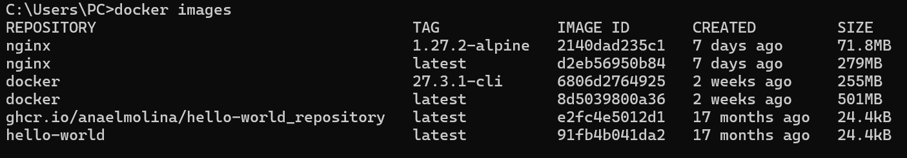

# Imagen
Es un archivo único que contiene todos los programas, librerías, dependencias y configuraciones necesarias para instalar y/o ejecutar una aplicación o un conjunto de aplicaciones.


## ¿Cuál es la relación entre una imagen y un contenedor? 
La imagen es el recurso estático que se utiliza para crear un contenedor. Cuando se corre un contenedor, este es una copia de la imagen en ejecución, donde se puede realizar modificaciones o ejecutar procesos.


## Comandos para imágenes

### Descargar imagen
Descarga la última versión de la imagen disponible en el registro de Docker.

```
docker pull <nombre imagen> 
```

Descarga una versión específica de la imagen, cada imagen tiene etiquetas (tags) para diferentes versiones.
Una imagen puede tener la etiqueta latest para representar la última versión, si no se especifica una etiqueta se hará referencia a la versión latest.

```
docker pull <nombre imagen>:<tag>
```

Descargar la imagen **hello-world**
* C:\Users\PC>docker run hello-world

Hello from Docker!
This message shows that your installation appears to be working correctly.

To generate this message, Docker took the following steps:
 1. The Docker client contacted the Docker daemon.
 2. The Docker daemon pulled the "hello-world" image from the Docker Hub.
    (amd64)
 3. The Docker daemon created a new container from that image which runs the
    executable that produces the output you are currently reading.
 4. The Docker daemon streamed that output to the Docker client, which sent it
    to your terminal.

To try something more ambitious, you can run an Ubuntu container with:
 $ docker run -it ubuntu bash

Share images, automate workflows, and more with a free Docker ID:
 https://hub.docker.com/

For more examples and ideas, visit:
 https://docs.docker.com/get-started/


**¿Qué es nginx**
Es un servidor web potente y versátil, muy utilizado en la industria por su rendimiento y capacidad para manejar grandes volúmenes de tráfico. Se adapta bien a una variedad de situaciones, desde servir sitios web simples hasta manejar arquitecturas complejas de microservicios.

Descargar la imagen  **nginx** en la versión **alpine**

* C:\Users\PC>docker pull nginx:1.27.2-alpine
1.27.2-alpine: Pulling from library/nginx
d1171b13e412: Download complete
472934715761: Download complete
fd072e74e282: Download complete
f99ac9ba1313: Download complete
45eb579d59b2: Download complete
379754eea6a7: Download complete
596d53a7de88: Download complete
Digest: sha256:2140dad235c130ac861018a4e13a6bc8aea3a35f3a40e20c1b060d51a7efd250
Status: Downloaded newer image for nginx:1.27.2-alpine
docker.io/library/nginx:1.27.2-alpine

# COMPLETAR

### Listar imágenes

```
docker images
```




**Identificadores**

En Docker, se utilizan varios identificadores para diferenciar de manera única los elementos del sistema, como imágenes, contenedores, volúmenes y redes. Estos identificadores son generados automáticamente por Docker y son únicos dentro del contexto del sistema Docker en el que se encuentran. 

### Inspeccionar una imagen
El comando docker inspect se utiliza para obtener información detallada sobre un objeto de Docker específico, como un contenedor, una imagen, un volumen o una red.  Proporciona información en formato JSON sobre el objeto especificado.

```
docker inspect <nombre imagen>
docker inspect <nombre imagen>:<tag>
```

Inspeccionar la imagen hello-world 
```
C:\Users\PC>docker inspect docker:27.3.1-cli
[
    {
        "Id": "sha256:6806d2764925d3b483f9732422b95321781765aeece274b4e60063d02e13efd6",
        "RepoTags": [
            "docker:27.3.1-cli"
        ],
        "RepoDigests": [
            "docker@sha256:6806d2764925d3b483f9732422b95321781765aeece274b4e60063d02e13efd6"
        ],
        "Parent": "",
        "Comment": "buildkit.dockerfile.v0",
        "Created": "2024-09-20T18:21:55Z",
        "DockerVersion": "27.2.0",
        "Author": "",
        "Config": {
            "Hostname": "",
            "Domainname": "",
            "User": "",
            "AttachStdin": false,
            "AttachStdout": false,
            "AttachStderr": false,
            "Tty": false,
            "OpenStdin": false,
            "StdinOnce": false,
            "Env": [
                "PATH=/usr/local/sbin:/usr/local/bin:/usr/sbin:/usr/bin:/sbin:/bin",
                "DOCKER_VERSION=27.3.1",
                "DOCKER_BUILDX_VERSION=0.17.1",
                "DOCKER_COMPOSE_VERSION=2.29.7",
                "DOCKER_TLS_CERTDIR=/certs"
            ],
            "Cmd": [
                "sh"
            ],
            "ArgsEscaped": true,
            "Image": "",
            "Volumes": null,
            "WorkingDir": "",
            "Entrypoint": [
                "docker-entrypoint.sh"
            ],
            "OnBuild": null,
            "Labels": null
        },
        "Architecture": "amd64",
        "Os": "linux",
        "Size": 67554191,
        "GraphDriver": {
            "Data": null,
            "Name": "overlayfs"
        },
        "RootFS": {
            "Type": "layers",
            "Layers": [
                "sha256:63ca1fbb43ae5034640e5e6cb3e083e05c290072c5366fcaa9d62435a4cced85",
                "sha256:46367e3dcdb5851251019becf28cb85565132affcbd126c60ff5fbfd024ba9b6",
                "sha256:5f70bf18a086007016e948b04aed3b82103a36bea41755b6cddfaf10ace3c6ef",
                "sha256:08ef13d695c4537d11fe4b352ddcc1195d9fa82cddea3baf111faf8cba37f615",
                "sha256:ef39a7a91695846ffe938e5bd4ee46467259ade30ec90cabc7f89a80e4903a10",
                "sha256:beaddcfc85f4dbb58fd94531d02b614329d0cfb07f28b76b9802a2be90e44696",
                "sha256:e5b9f8b77d2720eadb515b7adc457add3b0e2f94814b2e2c4a5891a14c322ff2",
                "sha256:5b6a17a5d3a79d3f6f18ae74c3ae7f36d8b8ebbea8a9365e0cd55a7d996a453f",
                "sha256:52ab6e31e0005d9977ac08700f4b14dfb694148361e5d07792f03e91b3462886",
                "sha256:bccd61a956869c7b1d00d4177cbec4e369ea21b20445dd57a8f5591b977acfd9"
            ]
        },
        "Metadata": {
            "LastTagTime": "2024-10-09T01:03:01.406040378Z"
        }
    }
]
```

# COMPLETAR

**¿Con qué algoritmo se está generando el ID de la imagen**
El ID de la imagen en Docker se está generando con el algoritmo **SHA-256**. Este es un algoritmo de hashing criptográfico que crea un identificador único basado en el contenido de la imagen.

### Filtrar imágenes

```
docker images | grep <termino a buscar>

```

### Para eliminar una imagen
Eliminar permanentemente la imagen de tu sistema Docker.

```
docker rmi <nombre imagen>:<tag>
```

Eliminar la imagen hello-world 
# COMPLETAR

-f: Es la opción para forzar la eliminación de la imagen incluso si hay contenedores en ejecución que utilizan esa imagen.
Cuando eliminas una imagen Docker, Docker no elimina automáticamente los contenedores que se han creado a partir de esa imagen. Esto significa que, aunque hayas eliminado la imagen, el contenedor seguirá ejecutándose normalmente.  
**Considerar**
Eliminar una imagen no afecta a los contenedores que se han creado a partir de esa imagen, a menos que esos contenedores dependan de archivos o configuraciones específicas de la imagen eliminada. En ese caso, es posible que los contenedores se comporten de manera inesperada después de eliminar la imagen.
Es una buena práctica detener y eliminar todos los contenedores que dependan de una imagen antes de eliminar la imagen en sí.

```
docker rmi -f <nombre imagen>:<tag>
```

