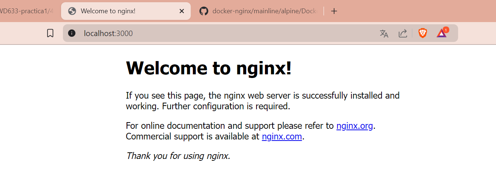

# Mapeo de puertos
El mapeo de puertos es un mecanismo que permite redirigir el tráfico de red desde un puerto en el host (tu máquina local o servidor) hacia un puerto específico en un contenedor Docker.
Por ejemplo, supongamos que tienes un contenedor que ejecuta un servidor web en el puerto 80 dentro del contenedor, pero quieres acceder a ese servidor desde tu navegador en la máquina host. Puedes usar el mapeo de puertos para redirigir el tráfico del puerto 80 del contenedor al puerto 3000 en el host. De esta manera, cuando accedas a http://localhost:3000 en tu navegador, el tráfico se dirigirá al servidor web dentro del contenedor en el puerto 80.


### Para crear un mapeo de puertos (puerto host y puerto contenedor)
El mapeo de puertos se especifica al ejecutar un contenedor Docker utilizando la opción -p o --publish seguida de los puertos que deseas mapear
```
docker run -d --name <nombre contenedor> -p <puerto host>:<puerto contenedor> <nombre imagen>:<tag>

```
Crear un contenedor a partir de la imagen nginx version alpine con el mapeo de puertos del ejemplo gráfico, host 3000 y contenedor 80
# COMPLETAR

```
Windows PowerShell
Windows PowerShell---------------------XXWindows PowerShell------------------------XXWindows PowerShell-----------------------------XXWindows PowerShell------------------------------------XXWindows PowerShell-------XX---------------------------------------XXWindows PowerShell------------------XXWindows PowerShell-------------------------------XXCopyright (C) Microsoftservados.
servados.

---------------------------------------XXInstale la versión más reciente de PowerShell para obtener nuevas características y mejoras. https://aka.ms/PSWindows

PS C:\Users\PC>docker run -d --name mi_contenedor_nginx -p 3000:80 nginx:alpine
docker: Error response from daemon: Conflict. The container name "/mi_contenedor_nginx" is already in use by container "725d3a379c909f401c3aa9b5aaeff7abbd5e0ba037b458fe752c922937a81bb5". You have to remove (or rename) that container to be able to reuse that name.   
See 'docker run --help'.
PS C:\Users\PC> docker ps             CONTAINER ID   IMAGE          COMMAND                  CREATED         STATUS         PORTS                  NAMES
725d3a379c90   nginx:alpine   "/docker-entrypoint.…"   2 minutes ago   Up 2 minutes   0.0.0.0:3000->80/tcp   mi_contenedor_nginx
```



### Para mapear más de un puerto

```
docker run -d --name <nombre contenedor> -p <puerto host 01>:<puerto contenedor 01> -p <puerto host 02>:<puerto contenedor 02> <nombre imagen>:<tag>
```

Crear un contenedor a partir de la imagen rabbitmq version management-alpine, para este mapeo de puertos usar en el host los mismos puertos del contenedor.
# COMPLETAR
```
PS C:\Users\PC> docker run -d --name mi_rabbitmq -p 5672:5672 -p 15672:15672 rabbitmq:3-management-alpine
Unable to find image 'rabbitmq:3-management-alpine' locally
3-management-alpine: Pulling from library/rabbitmq
67b3d380c81e: Pulling fs layer        
b8234549f281: Pulling fs layer        
88f38d486354: Pulling fs layer        
67b3d380c81e: Download complete       8MBB51cdb19c: Download complete       8eed8156f1b8: Download complete       58MB9fe2f10d: Download complete       
5fb3f867a591: Download complete       
e531f06be22c: Download complete       
Digest: sha256:dec9f8e86978cff263a2a65013b9a9f4b1f938c0a2576633cb783332573bcc69
Status: Downloaded newer image for rabbitmq:3-management-alpine
056b94f3dd3208786ae052ba8ecd06673ff14d3a84c709a9af367be96f6b1841
PS C:\Users\PC> 
```
